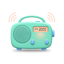

<p align="center">
  
</p>

<h1 align="center">TuneR</h1>

<p align="center">
  An internet radio app for macOS / iOS built with Tauri v2 + Vue 3<br>
  Tauri v2 + Vue 3 で作られた、macOS / iOS 向けインターネットラジオアプリ<br>
  <sub>The capital "R" stands for Radio / 大文字の R は Radio の R</sub>
</p>

<p align="center">
  <a href="#english">English</a> | <a href="#日本語">日本語</a>
</p>

---

## English

### Features

- 🌍 **Radio stations from all over the world** — search by country or keyword via the [Radio Browser API](https://www.radio-browser.info/)
- 🎵 **Now-playing song titles** — real-time ICY metadata (with a Rust-side fallback for stations without CORS support)
- 🔒 **Lock screen / Control Center integration** — shows song title, station name, and logo via the Media Session API, with playback controls
- 🪟 **Mini player** — a compact always-on-top remote window (macOS, `⌘⇧M`)
- ⭐ **Favorites** — one-click bookmarking with a paginated list
- 🌗 **Dark mode** — follows the system or toggle manually
- 🌐 **8 languages** — Japanese, English, German, Spanish, French, Korean, Portuguese (Brazil), Traditional Chinese
- 📱 **iPhone / iPad support** — background playback, keeps playing while locked

### Tech Stack

| Area | Technology |
|------|------------|
| Framework | [Tauri v2](https://tauri.app/) (Rust) + [Vue 3](https://vuejs.org/) (Composition API) |
| Build | Vite 7 + TypeScript |
| State | Pinia |
| UI | Tailwind CSS v4 + Headless UI + unplugin-icons (Heroicons) |
| i18n | vue-i18n |
| Audio | HTML5 Audio + IcecastMetadataPlayer + Rust (reqwest) fallback |

### Development

```bash
pnpm install

# Desktop (macOS)
pnpm tauri dev

# iOS simulator / device
pnpm tauri ios dev --host
```

### Build

```bash
# macOS universal binary (Intel + Apple Silicon)
pnpm tauri build --target universal-apple-darwin

# iOS (requires Apple Developer signing)
pnpm tauri ios build
```

### Rust Unit Tests

```bash
cd src-tauri && cargo test --lib
```

---

## 日本語

### 特徴

- 🌍 **世界中のラジオ局** — [Radio Browser API](https://www.radio-browser.info/) から国別・キーワードで検索
- 🎵 **今流れている曲名を表示** — ICY メタデータをリアルタイム取得（CORS 非対応局は Rust 側でフォールバック取得）
- 🔒 **ロック画面 / コントロールセンター対応** — Media Session 連携で曲名・局名・ロゴを表示、再生操作も可能
- 🪟 **ミニプレイヤー** — 常に手前に表示されるコンパクトなリモコンウィンドウ（macOS、`⌘⇧M`）
- ⭐ **お気に入り** — ワンクリックで登録、ページネーション付き一覧
- 🌗 **ダークモード** — システム連動 / 手動切替
- 🌐 **8言語対応** — 日本語・英語・ドイツ語・スペイン語・フランス語・韓国語・ポルトガル語(ブラジル)・中国語(繁体)
- 📱 **iPhone / iPad 対応** — バックグラウンド再生・ロック中の再生継続

### 技術スタック

| 分野 | 技術 |
|------|------|
| フレームワーク | [Tauri v2](https://tauri.app/) (Rust) + [Vue 3](https://vuejs.org/) (Composition API) |
| ビルド | Vite 7 + TypeScript |
| 状態管理 | Pinia |
| UI | Tailwind CSS v4 + Headless UI + unplugin-icons (Heroicons) |
| 国際化 | vue-i18n |
| 音声 | HTML5 Audio + IcecastMetadataPlayer + Rust (reqwest) フォールバック |

### 開発

```bash
pnpm install

# デスクトップ (macOS)
pnpm tauri dev

# iOS シミュレータ / 実機
pnpm tauri ios dev --host
```

### ビルド

```bash
# macOS ユニバーサルバイナリ (Intel + Apple Silicon)
pnpm tauri build --target universal-apple-darwin

# iOS (要 Apple Developer 署名)
pnpm tauri ios build
```

### Rust ユニットテスト

```bash
cd src-tauri && cargo test --lib
```
